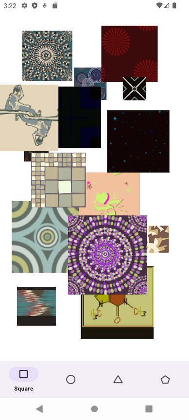
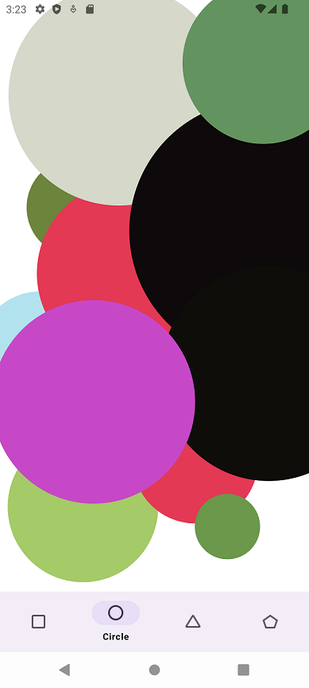
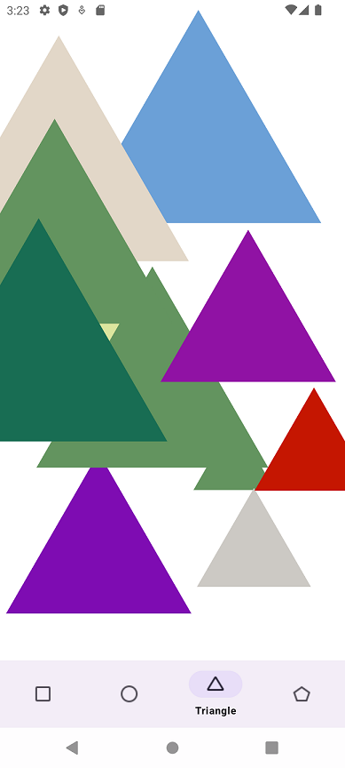
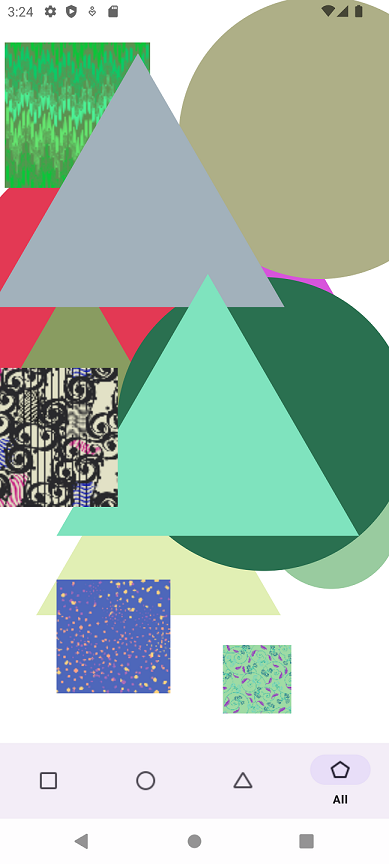

# KShape

## Function

1. **Display 4 tabs**

    - **`Square`**:

      Users are able to click on the screen to create a `Square Image` and double click on a Square to change the _image_

    - **`Circle`**:

      Users are able to click on the screen to create a `Filled Circle` and double click on a Circle to change the _color_

    - **`Triangle`**:

      Users are able to click on the screen to create a `Filled Triangle` and double click on a Triangle to change the _color_

    - **`All`**:

      Users are able to click on the screen to create a `Square Image`/`Filled Circle`/`Filled Triangle` and double click on a shape to change the _image_/_color_

2. **Shake device to clear all the shapes**

## Implementation

### 1. Package design

The application divide into following packages:

1. **`fragment`**: contains `BaseFragment` and derived fragments such as `SquareFragment`, `CircleFragment`, `TriangleFragment`, `MixFragment`.

2. **`network`**: contains network classes to download random colors/images (using `Retrofit`)

3. **`shape`**: contains `Shape` and derived shapes such as `Circle`, `Square`, `Triangle`.

4. **`util`**: contains utility classes such as:

    - `Logger`: to write debug log

    - `Util`: to generate random color/size

    - `BitmapPool`: to create a `Bitmap queue`, so that the application can get `bitmap` from queue and push `bitmap` from network

    - `ColorPool`: to create a `Color queue`, so that the application can get `color` from queue and push `color` from network

5. **`view`**: contains `ShapeView` and derived shapes such as `CircleView`, `SquareView`, `TriangleView`, `MixView`.

### 2. Details implementation

#### 2.1. `Shape`

This class has follwing properties and functions:

**Properties**

1. `centerPoint` (`PointF`): the center position (X, Y) of a shape

2. `size` (`Int`): size of a shape

3. `color` (`Int`): ARGB color of a shape

4. `bitmap` (`Bitmap?`): bitmap of a shape (Only `Square` use this property)

**Functions**

1. `abstract fun draw(canvas: Canvas, paint: Paint)`

    - To draw the shape on Canvas.
    - The derived classes must implement it to draw the correct shape

2. `abstract fun updateSelf(context: Context)`

    - To change color/image of the shape
    - The derived classes must implement it to change color/image based on the specific shape type

3. `fun isTouch(x: Float, y: Float): Boolean`

   To validate if the shape is touched by users

4. `fun distanceFromTouchPoint(x: Float, y: Float): Float`

   Calculate the distance between center of the shape and touch point

#### 2.2. `ShapeView`

This class has following properties and functions:

**Properties**

1. `paint` (`Paint`):

    - The paint object to be used by Canvas.
    - The derived classes must implement it to customize the Paint

2. `shapes` (`ArrayList<Shape>`): contains all created shapes

**Function**

1. `abstract fun createShape(x: Float, y: Float): Shape`:

   The derived classes must implement it to create a new shape with the touch point

2. `fun removeAllShapes()`:

   To remove all shapes when shaking device

3. `override fun onDraw(canvas: Canvas)`:

   Draw the all the shapes on Canvas

4. `override fun onTouchEvent(event: MotionEvent): Boolean`:

   Handle touch event to create/update a shape


#### 2.3. `ColorPool`

Fetching the color from network will take time, using `ColorPool` can help to reduce the delay.

The idea is that `ColorPool` contains a `queue`. Colors can be pushed from network and take out when needed.

```
When application launches, it will fetch some colors immediately using `fetchColor()`
```

**Implementation**

1. `fun getColor(): Int`:

    - This function returns a color from the queue (if the queue is empty, it return a color from function `getRandomColor()`).

    - After returning a color, if the queue's size is less than a THRESHOLD, it will request network to get more colors.

2. `fun fetchColor(requestCount: Int = 20)`:

    - Get colors from network (using `Coroutine` and `Retrofit`)

    - Push color to the queue when receiving the response

#### 2.3. `BitmapPool`

Fetching/Decoding the bitmap from network will take time, using `BitmapPool` can help to reduce the delay.

The idea is that `BitmapPool` contains a `queue`. Bitmaps can be pushed from network and take out when needed.

```
When application launches, it will fetch some bitmaps immediately using `fetchBitmap()`
```

**Implementation**

1. `fun getBitmap(context: Context): Bitmap?`:

    - This function returns a bitmap from the queue (if the queue is empty, it return a local image from `drawable`)

    - After returning a bitmap, if the queue's size is less than a THRESHOLD, it will request network to get more bitmaps.

2. `fun fetchBitmap(context: Context, requestCount: Int = 10)`:

    - Get bitmap from network (using `Coroutine`, `Retrofit` and `Glide`)

    - Push bitmap to the queue when receiving the response

## Further Improvement

1. To add more user's actions such as Moving a shape, Resizing a shape.
2. To add animation when creating a shape.
3. To improve bitmap memory by using Cache mechanism.
4. To improve the draw performance by not drawing invisible shapes.

## Screenshot







